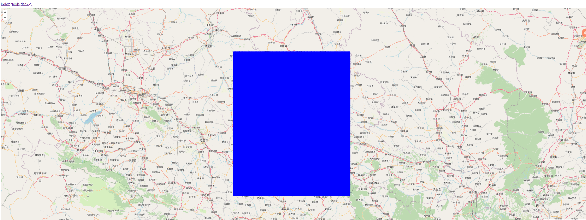
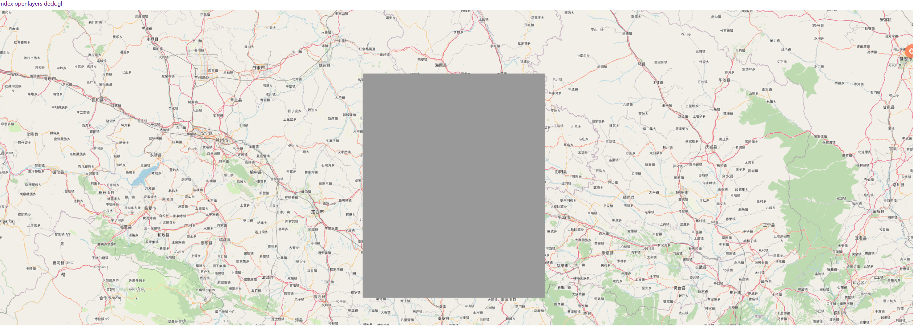
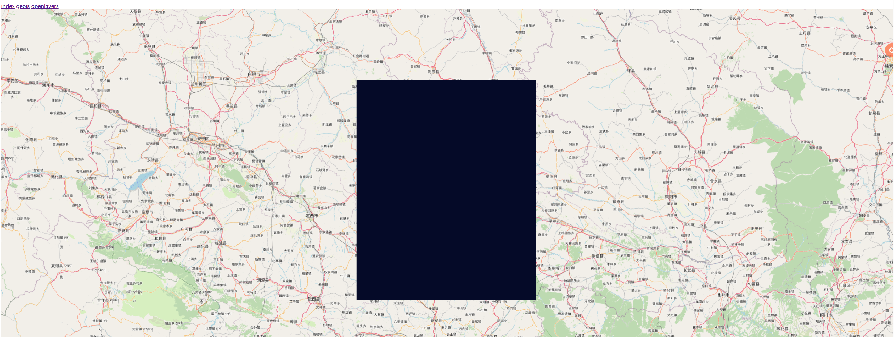

# Geo visualization library compares.

  Openlayers vs GeoJS vs ...

## Introduction

1. use vscode open this folder.

2. generate 90000 features, after exec following command, there will generate data file `data/features.json`

    `# python ./generate_features.py`

3. install dependencies

    `# npm install`

4. start to run

    `# npm run start`

5. screenshots

## Conclusion

    ...
